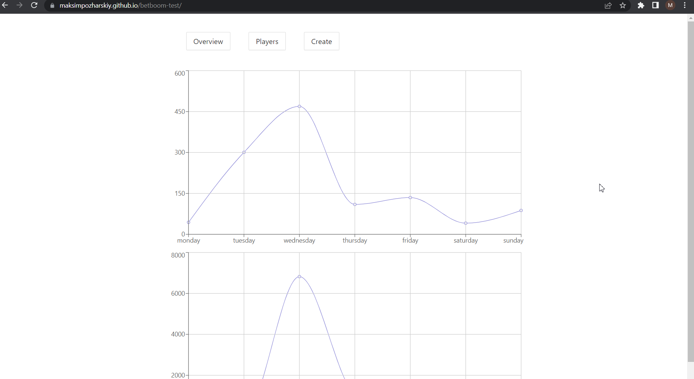

<h1 align="center">BetBoom test task</h1>

Web application for analyzing betting charts, wins and losses of players

## What is this web application for? 🤷‍♀️

It is an interactive application that allows the user to analyze bets.

Also, user can analyze bets of different players and create new player.

## Setting up development environment 🛠

- `git clone https://github.com/MaksimPozharskiy/betboom-test.git`
- `npm install`
- `npm run start`
- App should now be running on `http://localhost:3000/`

## Running unit tests 🚥

- Set up development environment
- `npm run test`

## Link to the project
- `https://maksimpozharskiy.github.io/betboom-test/`